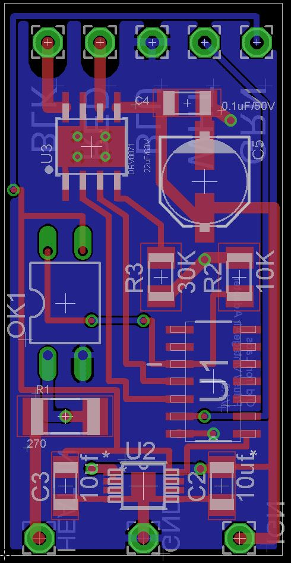

# VintageAir to Prius Heater Valve Adapter

Vintage Air systems ship with a simple on/off heater control valve which stops coolant flow to the heater core when the AC is on. 

Chevy GenV small block engines (L86/LT1, L83, etc) require constant flow through the heater loop, so a simple on/off valve is not suitable.

2nd Generation Toyota Prius' (2004-2009) have an ideal three-way coolant valve that is relatively inexpensive. (Sub-$20), but uses an ECU controlled motor.

This adapter connects the Vintage Air one-wire on/off signal to the five-wire Prius valve.

The adapter is based on an ATTiny24, with a DRV8871 motor driver. It is powered by an AP7583AQ voltage regulator, and the input level is shifted from IGN voltage by a PC817C optical coupler.

# Pinout

The Prius valve has a brushed DC motor that turns a ball valve through a worm drive. The valve stem is connected to a simple potentiometer. The motor and potentiometer pins are exposed in the five wire connector:

* Red - Brushed DC Motor
* Black - Brushed DC Motor
* White - Potentiometer Wiper
* Green - Potentiometer +
* Blue - Potentiometer -

The Vintage Air controller has one blue wire that is either N/C or +12v when the AC is on.

One side of the board has labeled pins for the color coded Prius valve wires. The other side takes +12v, GND, and the VintageAir in.

# BOM

| Part Number      | Quantity | Link               |
|------------------|----------|---------------------------|
| ATTiny24A-SSU         | 1        | https://www.digikey.com/en/products/detail/microchip-technology/ATTINY24A-SSU/2050982           |
| DRV8871          | 1        | https://www.digikey.com/en/products/detail/texas-instruments/DRV8871DDAR/5639726          |
| AP7583AQ-50MP-13         | 1        | https://www.digikey.com/en/products/detail/diodes-incorporated/AP7583AQ-50MP-13/17736704        |
| PC817C          | 1        | https://www.amazon.com/dp/B0DJ8ZBHJ2               |
| 1206 10uF Ceramic Capacitor        | 5        |            |
| 1206 0.1uF Ceramic Capacitor | 1 | |
| 22uF/63v Capacitor | 1 | https://www.digikey.com/en/products/detail/kemet/EDK226M063S9HAA/6597717|
| 2010 270ohm 1.25W Resistor | 1| https://www.digikey.com/en/products/detail/te-connectivity-passive-product/CRGP2010F270R/8577255 |
| 1206 10K Resistor | 1| |
| 1206 30K Resistor | 1| |

